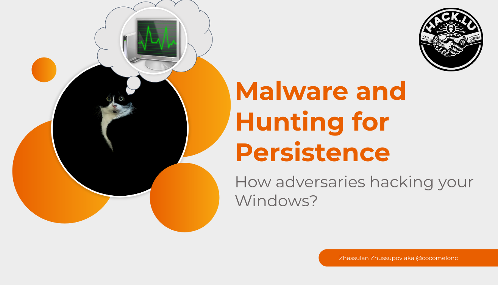

# Hacking Process Hacker 2

From my talk at HACK.LU 2024 - [https://www.youtube.com/watch?v=gW8v270HjxI](https://www.youtube.com/watch?v=gW8v270HjxI)     

     

This is example how you can abuse Process Hacker 2 (2.39.124) for Malware Persistence.     

Proof of Concept via using [Kill Defender](https://github.com/pwn1sher/KillDefender) trick.     

DEMO:     

     

This is not final version!!!      

**TODO**: add blog post about this on [https://cocomelonc.github.io](https://cocomelonc.github.io)      